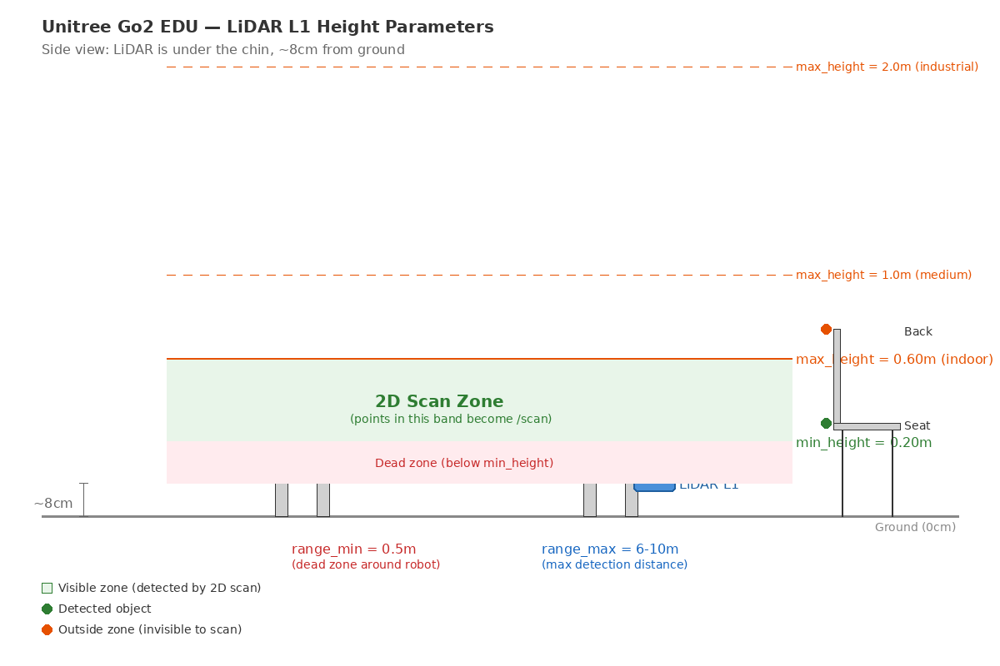

# Mapping SLAM - Unitree Go2 EDU

Source code for the WebRTC and Unitree Go2 EDU SDK, featuring custom camera calibrations, LiDAR processing, and DDS parameters. This setup has been fully validated and homologated for **ROS 2 Foxy**.

---

## 🚀 Quick Start with Pre-built Image (Recommended)

A fully configured Docker image with ROS 2 Foxy, CycloneDDS, the Go2 SDK, and all dependencies pre-installed is available on Docker Hub. **No compilation needed — just pull and run.**

### Prerequisites

- Linux (Ubuntu 20.04+ recommended)
- Docker Engine installed ([install guide](https://docs.docker.com/engine/install/ubuntu/))
- NVIDIA GPU + NVIDIA Container Toolkit (for RViz2 visualization)
- Wired Ethernet connection to the Unitree Go2 EDU robot

### 1. Host Preparation

Allow Docker to access the display and install the NVIDIA Container Toolkit:

```bash
# Allow GUI rendering
xhost +local:root

# Install NVIDIA Container Toolkit
curl -fsSL https://nvidia.github.io/libnvidia-container/gpgkey | sudo gpg --dearmor -o /usr/share/keyrings/nvidia-container-toolkit-keyring.gpg \
  && curl -s -L https://nvidia.github.io/libnvidia-container/stable/deb/nvidia-container-toolkit.list | \
    sed 's#deb https://#deb [signed-by=/usr/share/keyrings/nvidia-container-toolkit-keyring.gpg] https://#g' | \
    sudo tee /etc/apt/sources.list.d/nvidia-container-toolkit.list

sudo apt-get update
sudo apt-get install -y nvidia-container-toolkit
sudo nvidia-ctk runtime configure --runtime=docker
sudo systemctl restart docker
```

### 2. Host Network Setup

Before starting the container, configure the wired Ethernet connection to the robot **on the host**:

```bash
# Replace enx0c3796dc8be5 with YOUR adapter name (find with: ip a)
sudo ip link set enx0c3796dc8be5 up
sudo ip addr flush dev enx0c3796dc8be5
sudo ip addr add 192.168.123.100/24 dev enx0c3796dc8be5
sudo ip route add 192.168.123.0/24 dev enx0c3796dc8be5

# Test connection
ping -c 4 192.168.123.161
```

> ⚠️ **You must run this BEFORE starting any ROS 2 nodes.** If you see `No route to host` or `does not match an available interface`, the network is not configured.

### 3. Pull the Pre-built Image

```bash
docker pull mirandametri/unitree-go2-slam:cpp-decoder-v1
```

> This downloads ~8 GB (compressed). The full image is ~24 GB uncompressed and includes: ROS 2 Foxy, CycloneDDS, go2_robot_sdk, slam_toolbox, pointcloud_to_laserscan, wasmtime C API, voxel_decoder_cpp, PCL, and all Python/C++ dependencies.

### 4. Create the Docker Compose File

Create a folder for your project and the compose file:

```bash
mkdir -p ~/unitree_slam/workspace
cd ~/unitree_slam
nano docker-compose.yml
```

Paste the following content:

```yaml
version: '3.8'

services:
  ros2_foxy_dev:
    image: mirandametri/unitree-go2-slam:cpp-decoder-v1
    container_name: dev_unitree_go2
    network_mode: host      # Crucial for DDS/UDP traffic with the robot
    ipc: host               # Crucial for LiDAR shared memory
    pid: host
    environment:
      - DISPLAY=${DISPLAY}
      - QT_X11_NO_MITSHM=1
      - NVIDIA_DRIVER_CAPABILITIES=all
    volumes:
      - /tmp/.X11-unix:/tmp/.X11-unix:rw    # GUI rendering
      - ./workspace:/ros2_ws                # Persist maps on host
    deploy:
      resources:
        reservations:
          devices:
            - driver: nvidia
              count: all
              capabilities: [gpu]
    command: tail -f /dev/null
```

Save with `Ctrl+O`, `Enter`, `Ctrl+X`.

### 5. Start the Container

```bash
cd ~/unitree_slam
sudo docker compose up -d
sudo docker exec -it dev_unitree_go2 bash
```

You are now inside the container with everything ready. Proceed to the **Environment Setup** section below.

---

## 🛠️ Building from Source (Alternative)

If you prefer to build everything from scratch instead of using the pre-built image, use `osrf/ros:foxy-desktop` as the base image in the `docker-compose.yml`:

```yaml
    image: osrf/ros:foxy-desktop    # instead of mirandametri/unitree-go2-slam:cpp-decoder-v1
```

Then, inside the container, install dependencies and compile:

```bash
apt-get update
apt-get install -y python3-pip python3-colcon-common-extensions git python3-rosdep
apt-get install -y ros-foxy-rosidl-generator-dds-idl ros-foxy-fastrtps ros-foxy-rmw-fastrtps-cpp
apt-get install -y ros-foxy-pcl-ros ros-foxy-pcl-conversions ros-foxy-sensor-msgs-py ros-foxy-pointcloud-to-laserscan ros-foxy-slam-toolbox

cd /go2_webrtc_ws/src
git clone https://github.com/jmetrimiranda/Mapping_SLAM_Unitree_Go2_EDU.git go2_ros2_sdk
cd go2_ros2_sdk
git submodule update --init --recursive
pip3 install -r requirements.txt

cd /go2_webrtc_ws
source /opt/ros/foxy/setup.bash
colcon build
```

---

## 🔧 Environment Setup Script (`env_ros2.sh`)

Every terminal that runs a ROS 2 node **must** have the correct environment variables configured. Instead of typing 8 lines of exports every time, create a reusable script.

### Creating the script

Inside the container, run:

```bash
nano /env_ros2.sh
```

Paste the following content:

```bash
#!/bin/bash
# =============================================================
# env_ros2.sh — Source this file in EVERY terminal before
# running any ROS 2 command (nodes, topic list, rviz2, etc.)
# =============================================================

# --- ROS 2 Foxy core ---
# Loads the base ROS 2 installation (rcl, rclpy, rclcpp, etc.)
source /opt/ros/foxy/setup.bash

# --- CycloneDDS workspace ---
# Loads the custom-compiled CycloneDDS and its RMW layer.
# This replaces the default FastRTPS with CycloneDDS for better
# compatibility with the Unitree Go2's internal DDS traffic.
source /upgrade_dds_ws/install/setup.bash 2>/dev/null || true

# --- Go2 SDK workspace ---
# Loads the go2_robot_sdk, lidar_processor, lidar_processor_cpp,
# go2_interfaces, and all custom message types.
source /go2_webrtc_ws/install/setup.bash

# --- Locale ---
# Forces the C locale to avoid decimal separator issues (comma vs dot)
# in European/Brazilian systems. LC_NUMERIC ensures that floating-point
# parameters like "0.05" are parsed correctly by ROS 2 nodes.
export LC_ALL=C
export LC_NUMERIC="en_US.UTF-8"

# --- DDS Domain Isolation ---
# The Unitree Go2 robot runs its own internal ROS 2 nodes on domain 0.
# We use domain 42 to isolate our SLAM pipeline from the robot's
# internal traffic. Without this, you get ghost nodes and topic conflicts.
export ROS_DOMAIN_ID=42

# --- DDS Implementation ---
# Switches from the default FastRTPS to CycloneDDS.
# CycloneDDS handles the Go2's large UDP packets (LiDAR data) much
# better than FastRTPS, which tends to fragment and drop them.
export RMW_IMPLEMENTATION=rmw_cyclonedds_cpp

# --- CycloneDDS Configuration ---
# NetworkInterfaceAddress: The wired Ethernet adapter connected to the robot.
#   Find yours with: ip a | grep "192.168.123" (on the host, before Docker)
#   Common names: enx0c3796dc8be5, eth0, eno1
# MaxMessageSize: 65500 bytes (max UDP payload, prevents fragmentation)
# FragmentSize: 4000 bytes (CycloneDDS internal fragment size)
# WhcHigh: 500kB write-cache watermark (prevents buffer overflow at 7+ Hz)
export CYCLONEDDS_URI="<CycloneDDS><Domain><General><NetworkInterfaceAddress>enx0c3796dc8be5</NetworkInterfaceAddress><MaxMessageSize>65500</MaxMessageSize><FragmentSize>4000</FragmentSize></General><Internal><Watermarks><WhcHigh>500kB</WhcHigh></Watermarks></Internal></Domain></CycloneDDS>"

echo "ROS 2 environment configured:"
echo "  ROS_DOMAIN_ID=$ROS_DOMAIN_ID"
echo "  RMW=$RMW_IMPLEMENTATION"
echo "  Interface=enx0c3796dc8be5"
```

Save with `Ctrl+O`, `Enter`, `Ctrl+X`. Then make it executable:

```bash
chmod +x /env_ros2.sh
```

> ⚠️ **IMPORTANT:** Replace `enx0c3796dc8be5` with **your** network interface name. Find it on the **host** (not inside Docker) by running `ip a` and looking for the adapter with IP `192.168.123.x`.

### Usage

In every new terminal, before running any ROS 2 command:

```bash
source /env_ros2.sh
```

---

## ⚡ C++ High-Performance Mode — 2 Terminals (Recommended)

Uses a native C++ decoder (`voxel_decoder_cpp`) that offloads LiDAR decoding from the Python driver, reducing CPU usage from ~75% to ~25% while increasing the scan rate from ~7 Hz to ~7.7 Hz.

> 💡 **When to use:** This is the recommended mode for all mapping sessions. The C++ decoder uses wasmtime to run the same `libvoxel.wasm` algorithm natively, freeing CPU for SLAM and other tasks.

### Performance Comparison

| Metric | Python Pipeline | C++ Pipeline |
|---|---|---|
| Total CPU usage | ~75% | **~25%** |
| Driver CPU | ~75% | **~6%** |
| /scan frequency | ~7 Hz | **~7.7 Hz** |
| SLAM quality | Good | **Good** |

### Terminal 1 — Pipeline

```bash
source /env_ros2.sh
export LD_LIBRARY_PATH=/opt/wasmtime/lib:$LD_LIBRARY_PATH

# Kill any leftover processes from previous sessions
pkill -f "go2_driver\|voxel_decoder\|pointcloud_to_laser\|slam_tool\|static_transform\|rviz2"
sleep 3

# 1. WebRTC Driver — connects to the robot, publishes raw compressed voxels
#    decode_lidar:=false → does NOT decode LiDAR (saves ~70% CPU)
#    publish_raw_voxel:=true → publishes compressed data for the C++ decoder
ros2 run go2_robot_sdk go2_driver_node --ros-args \
  -p conn_type:="webrtc" \
  -p robot_ip:="192.168.123.161" \
  -p enable_video:=false \
  -p decode_lidar:=false \
  -p publish_raw_voxel:=true &
sleep 8

# 2. C++ Voxel Decoder — decodes compressed voxels natively via wasmtime
#    Subscribes: /utlidar/voxel_map_compressed (Best Effort)
#    Publishes:  /point_cloud2 (Best Effort)
ros2 run voxel_decoder_cpp voxel_decoder_node &
sleep 3

# 3. TF Publisher — defines the LiDAR's position on the robot body
ros2 run tf2_ros static_transform_publisher \
  0.289 0.0 0.08 0.0 0.0 0.0 base_link utlidar_lidar &
sleep 1

# 4. PointCloud Slicer — converts 3D point cloud into 2D laser scan
#    Adjust for your environment — see LiDAR Tuning Guide below
ros2 run pointcloud_to_laserscan pointcloud_to_laserscan_node --ros-args \
  -p target_frame:=utlidar_lidar \
  -p min_height:=0.20 \
  -p max_height:=0.60 \
  -p range_min:=0.5 \
  -p range_max:=8.0 \
  -r cloud_in:=/point_cloud2 &
sleep 1

# 5. SLAM — builds the 2D occupancy grid map
#    Adjust for your environment — see LiDAR Tuning Guide below
ros2 run slam_toolbox async_slam_toolbox_node --ros-args \
  -p odom_frame:=odom \
  -p base_frame:=base_link \
  -p map_frame:=map \
  -p max_laser_range:=8.0 \
  -p resolution:=0.05 \
  -p minimum_travel_distance:=0.3 \
  -p minimum_travel_heading:=0.3 &
sleep 2

echo "C++ Pipeline running. Open RViz2 in Terminal 2."
wait
```

### Terminal 2 — Visualization

Open a second terminal in the container:

```bash
docker exec -it dev_unitree_go2 bash
source /env_ros2.sh
rviz2
```

**RViz2 Setup (do this in order):**

1. Set **Fixed Frame** to `map` (top-left dropdown)
2. Click **Add** → **By topic** → `/map` → **Map** → OK (leave QoS as default: Reliable + Transient Local)
3. Click **Add** → **By display type** → **LaserScan** → OK, then:
   - Expand **Topic** → set **Reliability Policy** to **Best Effort**
   - Set Topic to `/scan`
4. (Optional) Click **Add** → **By display type** → **PointCloud2** → OK, then:
   - Expand **Topic** → set **Reliability Policy** to **Best Effort**
   - Set Topic to `/point_cloud2`
   - Set **Decay Time** to `999` to accumulate points as the robot moves (builds a persistent 3D model)
   - Set **Style** to `Points`, **Size** to `0.005` for a dense visualization

To stop the pipeline, press `Ctrl+C` in Terminal 1.

---

## 🐍 Python Mode — 2 Terminals (Legacy)

The original pipeline where the Python driver decodes the LiDAR internally. Uses more CPU (~75%) but requires no additional dependencies. Both pipelines coexist in the same Docker image — just change the launch parameters.

> 💡 **When to use:** Fallback if the C++ decoder has issues, or for comparison/debugging.

### Terminal 1 — Pipeline

```bash
source /env_ros2.sh

# Kill any leftover processes from previous sessions
pkill -f "go2_driver\|voxel_decoder\|pointcloud_to_laser\|slam_tool\|static_transform\|rviz2"
sleep 3

# 1. WebRTC Driver — connects to the robot and decodes LiDAR data internally
#    decode_lidar:=true → Python driver decodes voxels (high CPU)
ros2 run go2_robot_sdk go2_driver_node --ros-args \
  -p conn_type:="webrtc" \
  -p robot_ip:="192.168.123.161" \
  -p enable_video:=false \
  -p decode_lidar:=true \
  -p publish_raw_voxel:=false &
sleep 8

# 2. TF Publisher
ros2 run tf2_ros static_transform_publisher \
  0.289 0.0 0.08 0.0 0.0 0.0 base_link utlidar_lidar &
sleep 1

# 3. PointCloud Slicer
ros2 run pointcloud_to_laserscan pointcloud_to_laserscan_node --ros-args \
  -p target_frame:=utlidar_lidar \
  -p min_height:=0.20 \
  -p max_height:=0.60 \
  -p range_min:=0.5 \
  -p range_max:=8.0 \
  -r cloud_in:=/point_cloud2 &
sleep 1

# 4. SLAM
ros2 run slam_toolbox async_slam_toolbox_node --ros-args \
  -p odom_frame:=odom \
  -p base_frame:=base_link \
  -p map_frame:=map \
  -p max_laser_range:=8.0 \
  -p resolution:=0.05 \
  -p minimum_travel_distance:=0.3 \
  -p minimum_travel_heading:=0.3 &
sleep 2

echo "Python Pipeline running. Open RViz2 in Terminal 2."
wait
```

### Terminal 2 — Visualization

Same as C++ mode:

```bash
docker exec -it dev_unitree_go2 bash
source /env_ros2.sh
rviz2
```

---

## 🐢 Standard Mode — Multi-Terminal (5 Terminals)

Each node runs in its own terminal for better debugging and control. Identical pipeline to Quick Mode, but you can monitor each node's output individually.

> 💡 **When to use:** Debugging, parameter tuning, or when you need to restart individual nodes without killing the whole pipeline.

**Run `source /env_ros2.sh` in ALL 5 terminals before starting.** For the C++ pipeline, also run `export LD_LIBRARY_PATH=/opt/wasmtime/lib:$LD_LIBRARY_PATH` in Terminals 1 and 2.

### Terminal 1 — WebRTC Driver

```bash
# C++ mode (recommended):
ros2 run go2_robot_sdk go2_driver_node --ros-args \
  -p conn_type:="webrtc" \
  -p robot_ip:="192.168.123.161" \
  -p enable_video:=false \
  -p decode_lidar:=false \
  -p publish_raw_voxel:=true

# Python mode (legacy):
# ros2 run go2_robot_sdk go2_driver_node --ros-args \
#   -p conn_type:="webrtc" \
#   -p robot_ip:="192.168.123.161" \
#   -p enable_video:=false \
#   -p decode_lidar:=true \
#   -p publish_raw_voxel:=false
```

### Terminal 2 — C++ Voxel Decoder (C++ mode only)

```bash
ros2 run voxel_decoder_cpp voxel_decoder_node
```

> Skip this terminal if using Python mode (`decode_lidar:=true`).

### Terminal 3 — TF Publisher

```bash
ros2 run tf2_ros static_transform_publisher \
  0.289 0.0 0.08 0.0 0.0 0.0 base_link utlidar_lidar
```

### Terminal 4 — PointCloud Slicer

```bash
ros2 run pointcloud_to_laserscan pointcloud_to_laserscan_node --ros-args \
  -p target_frame:=utlidar_lidar \
  -p min_height:=0.20 \
  -p max_height:=0.60 \
  -p range_min:=0.5 \
  -p range_max:=8.0 \
  -r cloud_in:=/point_cloud2
```

### Terminal 5 — SLAM

```bash
ros2 run slam_toolbox async_slam_toolbox_node --ros-args \
  -p odom_frame:=odom \
  -p base_frame:=base_link \
  -p map_frame:=map \
  -p max_laser_range:=8.0 \
  -p resolution:=0.05 \
  -p minimum_travel_distance:=0.3 \
  -p minimum_travel_heading:=0.3
```

### Terminal 6 — RViz2

```bash
rviz2
```

Follow the same RViz2 setup instructions from the C++ mode section above.

---

## 🎯 LiDAR L1 Tuning Guide

The Unitree Go2 EDU uses the **L1 LiDAR**, mounted **under the robot's chin** (front-bottom), approximately **8cm from the ground**. The LiDAR emits rays in all directions (up, down, and around) producing a full 3D point cloud. The `pointcloud_to_laserscan` node then filters this cloud, keeping only points within a specific height band to create the 2D scan used by SLAM.

### How the 2D Scan Works

The LiDAR produces a 3D point cloud covering everything around the robot. The `pointcloud_to_laserscan` node slices a horizontal band from this cloud to create a 2D scan for SLAM:



**Vertical parameters** (measured from the LiDAR position, not from the ground):

| Parameter | What it does | Too low | Too high |
|---|---|---|---|
| `min_height` | Bottom of scan band | Ground noise, robot legs visible | Misses low obstacles (steps, cables) |
| `max_height` | Top of scan band | Misses tall objects (chairs, shelves) | Ceiling reflections, more noise |

> ⚠️ **`min_height` must always be less than `max_height`.** If inverted (e.g., min=0.8, max=0.2), no points can pass the filter and the scan will be empty.

**Horizontal parameters** (distance from robot center):

| Parameter | What it does | Too low | Too high |
|---|---|---|---|
| `range_min` | Dead zone around robot | Sees own legs/body as obstacles | Misses nearby walls in corridors |
| `range_max` | Max detection distance | Misses distant walls | Multi-path reflections, ghost points |

### Environment Profiles

#### 🏭 Large Industrial (factory, warehouse, power plant)

Open areas, tall equipment (conveyors, tanks, machinery), long corridors.

```bash
# PointCloud Slicer
-p min_height:=0.20 -p max_height:=2.0 -p range_min:=0.5 -p range_max:=10.0

# SLAM
-p max_laser_range:=10.0 -p resolution:=0.10 -p minimum_travel_distance:=0.5 -p minimum_travel_heading:=0.5
```

- `max_height: 2.0` — Captures conveyors, tanks, tall machinery
- `resolution: 0.10` — 10cm/pixel, clean maps for large areas
- `minimum_travel_distance: 0.5` — Less frequent updates, cleaner result

#### 🏢 Medium Room (office, lab, empty room)

Regular walls, some furniture, moderate distances.

```bash
# PointCloud Slicer
-p min_height:=0.20 -p max_height:=0.80 -p range_min:=0.5 -p range_max:=8.0

# SLAM
-p max_laser_range:=8.0 -p resolution:=0.05 -p minimum_travel_distance:=0.3 -p minimum_travel_heading:=0.3
```

- `max_height: 0.80` — Captures desks, shelves, door frames
- `resolution: 0.05` — 5cm/pixel, good balance of detail and noise

#### 🏠 Small Cluttered Space (bedroom, storage room, workshop)

Many objects close together, narrow passages, lots of furniture at various heights.

```bash
# PointCloud Slicer
-p min_height:=0.25 -p max_height:=0.50 -p range_min:=0.3 -p range_max:=5.0

# SLAM
-p max_laser_range:=5.0 -p resolution:=0.03 -p minimum_travel_distance:=0.2 -p minimum_travel_heading:=0.2
```

- `min_height: 0.25` — Filters shoes, cables, floor clutter
- `range_min: 0.3` — Detects furniture in tight spaces
- `resolution: 0.03` — 3cm/pixel, fine detail for small areas

### Practical LiDAR Test — Object Detection

Follow this procedure to verify your parameters are correctly tuned:

**1. Place a test object** (chair, box, trash can) **1.5 meters** in front of the robot.

**2. Start the pipeline** and open RViz2 with both LaserScan and PointCloud2 displays.

**3. Check the LaserScan display.** The object should appear as a cluster of points at ~1.5m. If not:

| Problem | Cause | Fix |
|---|---|---|
| Object not visible | Below `min_height` | Decrease `min_height` |
| Object not visible | Above `max_height` | Increase `max_height` |
| Object not visible | Inside `range_min` dead zone | Decrease `range_min` |
| Object partially visible | Only part is in the scan band | Widen `min_height`/`max_height` range |

**4. Walk the robot around the object.** The `/map` should draw the object's outline. With PointCloud2 `Decay Time = 999`, you'll see the 3D shape accumulating.

**5. Fine-tune without restarting everything** — kill and relaunch only the slicer:

```bash
pkill -f pointcloud_to_laser
sleep 1
ros2 run pointcloud_to_laserscan pointcloud_to_laserscan_node --ros-args \
  -p target_frame:=utlidar_lidar \
  -p min_height:=0.15 \
  -p max_height:=1.0 \
  -p range_min:=0.3 \
  -p range_max:=8.0 \
  -r cloud_in:=/point_cloud2 &
```

### Diagnostic Commands

Run in a new terminal with `source /env_ros2.sh`:

```bash
# Check scan frequency (expect ~7.7 Hz)
ros2 topic hz /point_cloud2

# Check current scan parameters
ros2 topic echo /scan | grep -A2 "range_min"

# Check points per frame
ros2 topic echo /point_cloud2 | grep "width"

# Check CPU usage per node
top -bn1 | grep -E "voxel_deco|go2_driver|pointcloud|slam"

# List all active topics
ros2 topic list

# Check QoS compatibility
ros2 topic info /point_cloud2 --verbose
```

### Common Noise Sources and Fixes

| Noise Source | Symptom | Fix |
|---|---|---|
| Robot's own legs | Points at ~30cm in all directions | Increase `range_min` to `0.5` |
| Ground reflections | Random points near robot at ground level | Increase `min_height` to `0.25` |
| Ceiling reflections | Points appearing above real obstacles | Decrease `max_height` |
| Glass / mirrors | Ghost walls, duplicated room geometry | No LiDAR fix — avoid glass surfaces |
| Multi-path reflections | Scattered random points in small rooms | Decrease `range_max` |
| Moving people | Temporary blobs appearing in the map | Increase `minimum_travel_distance` |
| Shiny metal surfaces | Sporadic false points at random distances | Increase `min_height`, lower `range_max` |

---

## 📊 Architecture Overview

### C++ High-Performance Pipeline (Recommended)

```
┌─────────────────────────────────────────────────────────────┐
│                    Unitree Go2 EDU                          │
│              (192.168.123.161, WebRTC)                       │
└─────────────┬───────────────────────────────────────────────┘
              │ Compressed Voxels via WebRTC
              ▼
┌─────────────────────────────────────────────────────────────┐
│  go2_driver_node (Python, decode_lidar:=false, ~6% CPU)     │
│  Does NOT decode — publishes raw compressed voxels          │
│  Publishes: /utlidar/voxel_map_compressed (Best Effort)     │
│  Also publishes: /odom, /imu, /tf, /joint_states            │
└─────────────┬───────────────────────────────────────────────┘
              │ /utlidar/voxel_map_compressed (~7.7 Hz)
              ▼
┌─────────────────────────────────────────────────────────────┐
│  voxel_decoder_node (C++, wasmtime, ~19% CPU)               │
│  Decodes libvoxel.wasm natively via wasmtime C API          │
│  Converts raw bytes → XYZ + intensity (C++ pure, no numpy)  │
│  Publishes: /point_cloud2 (Best Effort)                     │
└─────────────┬───────────────────────────────────────────────┘
              │ /point_cloud2 (PointCloud2, ~7.7 Hz)
              ▼
┌─────────────────────────────────────────────────────────────┐
│  pointcloud_to_laserscan_node                               │
│  Slices 3D cloud → 2D laser scan                            │
│  Input: /point_cloud2  Output: /scan (Best Effort)          │
└─────────────┬───────────────────────────────────────────────┘
              │ /scan (LaserScan, ~7.7 Hz)
              ▼
┌─────────────────────────────────────────────────────────────┐
│  async_slam_toolbox_node                                    │
│  Builds occupancy grid from laser scans + odometry          │
│  Output: /map (Reliable + Transient Local)                  │
└─────────────┬───────────────────────────────────────────────┘
              │ /map (OccupancyGrid)
              ▼
┌─────────────────────────────────────────────────────────────┐
│  RViz2 (Visualization)                                      │
│  Map: Reliable | LaserScan/PointCloud2: Best Effort         │
└─────────────────────────────────────────────────────────────┘
```

### Python Legacy Pipeline

```
┌─────────────────────────────────────────────────────────────┐
│                    Unitree Go2 EDU                          │
│              (192.168.123.161, WebRTC)                       │
└─────────────┬───────────────────────────────────────────────┘
              │ Compressed Voxels via WebRTC
              ▼
┌─────────────────────────────────────────────────────────────┐
│  go2_driver_node (Python, decode_lidar:=true, ~75% CPU)     │
│  Decodes voxels → publishes /point_cloud2 (Best Effort)     │
│  Also publishes: /odom, /imu, /tf, /joint_states            │
└─────────────┬───────────────────────────────────────────────┘
              │ /point_cloud2 (PointCloud2, ~7 Hz)
              ▼
┌─────────────────────────────────────────────────────────────┐
│  pointcloud_to_laserscan_node → slam_toolbox → /map         │
└─────────────────────────────────────────────────────────────┘
```

---

## 📐 Parameter Reference

### WebRTC Driver Parameters

| Parameter | Default | Description |
|---|---|---|
| `conn_type` | `"webrtc"` | Connection protocol. Always `"webrtc"` for Go2 EDU. |
| `robot_ip` | `"192.168.123.161"` | Robot's IP on the wired Ethernet. Default for Go2 EDU. |
| `enable_video` | `false` | Enable camera stream. Set `true` for visual SLAM or object detection. Increases CPU usage. Best used with C++ pipeline. |
| `decode_lidar` | `true` | Decode compressed voxels into PointCloud2 inside the driver. Set `false` for C++ pipeline. |
| `publish_raw_voxel` | `false` | Publish raw compressed voxels on `/utlidar/voxel_map_compressed`. Set `true` for C++ pipeline. |

### PointCloud Slicer Parameters

These control how the 3D point cloud is "sliced" into a 2D laser scan for SLAM.

| Parameter | Default | Description | Tuning Guide |
|---|---|---|---|
| `target_frame` | `utlidar_lidar` | TF frame for the output scan. Must match the TF publisher. | Don't change. |
| `min_height` | `0.20` | Minimum height (meters) above the LiDAR to include in the 2D slice. | **Lower = more ground noise.** Raise to 0.25 if you see false obstacles near the robot. |
| `max_height` | `0.60` | Maximum height (meters) above the LiDAR to include. | **Higher = captures taller objects** but may include ceiling reflections. For outdoor/industrial use, try 1.0–2.0. |
| `range_min` | `0.5` | Minimum distance (meters) to accept a point. | **Raise to 0.6–0.8** if you see noise from the robot's own body. Lower to 0.3 for tight spaces. |
| `range_max` | `8.0` | Maximum distance (meters). Points beyond this are discarded. | The Go2 LiDAR has ~8m effective range. Setting higher than 10 just adds noise. |

### SLAM Parameters

| Parameter | Default | Description | Tuning Guide |
|---|---|---|---|
| `odom_frame` | `odom` | Odometry frame from the robot. | Don't change. |
| `base_frame` | `base_link` | Robot's base frame. | Don't change. |
| `map_frame` | `map` | Output map frame. | Don't change. |
| `max_laser_range` | `8.0` | Maximum range (meters) for SLAM scan matching. | Match or slightly exceed your `range_max`. |
| `resolution` | `0.05` | Map resolution in meters/pixel. 0.05 = 5cm per cell. | **Lower = more detail but more noise.** Try 0.03 for small rooms, 0.10 for large warehouses. |
| `minimum_travel_distance` | `0.3` | Minimum distance (meters) the robot must travel before a new scan is added. | **Higher = fewer scans, cleaner map, faster.** Lower = more dense but noisier. |
| `minimum_travel_heading` | `0.3` | Minimum rotation (radians, ~17°) before a new scan is added. | Same trade-off as above. |

### TF Publisher Parameters

The 6 numbers represent the LiDAR's position relative to `base_link`: `x y z roll pitch yaw`

| Value | Meaning | Go2 Default |
|---|---|---|
| `0.289` | X offset — LiDAR is 28.9cm forward of center | Measured on Go2 EDU |
| `0.0` | Y offset — centered laterally | — |
| `0.08` | Z offset — LiDAR is 8cm above the base | Measured on Go2 EDU |
| `0.0 0.0 0.0` | No rotation (roll, pitch, yaw) | LiDAR is level |

---

## 🐳 Docker Image Tags

All images are available on [Docker Hub](https://hub.docker.com/r/mirandametri/unitree-go2-slam/tags):

| Tag | Description |
|---|---|
| `cpp-decoder-v1` | **Recommended.** Full pipeline with C++ voxel decoder + Python fallback. |
| `python-stable` | Python-only pipeline. Backup before C++ changes. |
| `latest` | Previous stable state. |

### Switching Between Images

Edit `docker-compose.yml` and change the `image:` line:

```yaml
# For C++ pipeline (recommended):
image: mirandametri/unitree-go2-slam:cpp-decoder-v1

# For Python-only fallback:
image: mirandametri/unitree-go2-slam:python-stable
```

Then recreate the container:

```bash
docker compose down
sudo docker compose up -d
sudo docker exec -it dev_unitree_go2 bash
```

> **Note:** You do NOT need to switch images to alternate between C++ and Python pipelines. Both pipelines coexist in `cpp-decoder-v1` — just change the launch parameters (`decode_lidar:=true/false`).

---

## 💾 Saving Maps

### Save current map as image

```bash
docker exec -it dev_unitree_go2 bash
source /env_ros2.sh
ros2 run nav2_map_server map_saver_cli -f /ros2_ws/my_map_name
```

> **Note:** Always save to `/ros2_ws` to ensure the files are persisted on your host machine (mounted via Docker volume).

This generates two files:
- `my_map_name.pgm` — The occupancy grid image
- `my_map_name.yaml` — Map metadata (resolution, origin, etc.)

### Save SLAM state (to continue mapping later)

```bash
ros2 service call /slam_toolbox/serialize_map slam_toolbox/srv/SerializePoseGraph "{filename: '/ros2_ws/my_map'}"
```

### Load saved map and continue mapping

Add to the SLAM node launch:

```bash
-p map_file_name:=/ros2_ws/my_map \
-p map_start_at_dock:=true
```

### Record raw data (rosbag)

```bash
ros2 bag record /point_cloud2 /scan /odom /tf /tf_static /map -o /ros2_ws/session_01
```

Replay later:

```bash
ros2 bag play /ros2_ws/session_01
```

---

## ⚠️ Troubleshooting

### `No route to host` / `Failed to get robot public key`

The network connection to the robot is not established. **On the host** (not inside Docker):

```bash
sudo ip link set enx0c3796dc8be5 up
sudo ip addr flush dev enx0c3796dc8be5
sudo ip addr add 192.168.123.100/24 dev enx0c3796dc8be5
ping -c 4 192.168.123.161
```

If ping succeeds, restart the pipeline inside the container.

### `does not match an available interface supporting udp`

The Ethernet adapter is not connected or has a different name. Check on the host:

```bash
ip link show | grep enx
```

If the name is different, update `/env_ros2.sh` inside the container with the correct interface name.

### Map flickering / alternating between old and new maps

This happens when DDS retains cached map data from previous sessions (Transient Local durability). Restart the Docker container to clear all DDS memory:

```bash
# On the HOST (not inside Docker):
docker restart dev_unitree_go2
sleep 5
docker exec -it dev_unitree_go2 bash
```

**Always restart the container before a new mapping session** to avoid ghost maps.

### `enable_video:=true` causes crash or connection failure

Video requires a stable WebRTC connection and additional CPU. Common causes:

1. **Network not configured** → run the host network setup first
2. **Robot not ready** → wait for "Robot 0 validated and ready" in the logs before enabling video
3. **CPU overload (Python mode)** → use the **C++ pipeline** (`decode_lidar:=false`), which frees ~50% CPU for video processing

**Recommended:** use `enable_video:=true` with the C++ pipeline to avoid CPU overload.

### QoS warnings in the terminal

Messages like `New subscription discovered... incompatible QoS... RELIABILITY_QOS_POLICY` are **normal** and can be safely ignored. They appear when RViz2 auto-discovers topics before you manually set the Reliability Policy to Best Effort.

### `Message Filter dropping message: frame 'utlidar_lidar'`

This is normal during the first 2-3 seconds of startup. The TF tree takes a moment to propagate. If it persists for more than 10 seconds, check that the `static_transform_publisher` is running.

### No data in RViz2

1. Make sure you ran `source /env_ros2.sh` in the RViz2 terminal
2. Check that `ros2 topic hz /point_cloud2` shows ~7 Hz
3. Verify Reliability Policy is set to **Best Effort** for LaserScan and PointCloud2 displays
4. The Map display should use the **default** QoS (Reliable + Transient Local) — do NOT change it to Best Effort